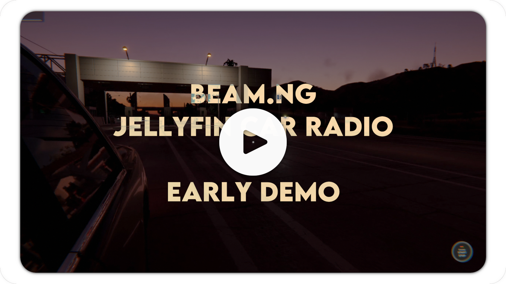

<div align="center">
  <h1>BeamNG.drive Jellyfin Car Radio</h1>
  <p>Yet another car radio / music mod for BeamNG.drive</p>
  <p>
    
    
    <a href="../../releases"></a>
  </p>
</div>

<div align="center">
  <a href="https://cloud.disroot.org/s/sDzxbQfHxnJYrZ3?dir=/&editing=false&openfile=true">
    
  </a>
</div>

Radio for your car that plays music from your Jellyfin media server with sweet 3D positional audio, plus:

- Distance muffling
- Cabin bass shelf
- Speed lift
- Loudness normalization

> [!WARNING]
> This mod is currently untested on Windows and non-local Jellyfin. Testers & contributors would be greatly appreciated.

# Installation

> [!NOTE]
> For brevity, `${BEAM}` is just shorthand for `~/.local/share/BeamNG/BeamNG.drive/current/` (Linux) or `%LOCALAPPDATA%\BeamNG\BeamNG.drive\current\` (Windows).

1. Download `jellyfin_car_radio.zip` from the latest [Release](../../releases) and put it in your mods folder (`${BEAM}/mods/`).
2. Create `${BEAM}/settings/jellyfin_car_radio/config.json`:

```json
{
  "server_url": "http://127.0.0.1:8096",
  "api_key": "your-jellyfin-api-key",
  "volume": 0.5
}
```

3. Generate and fill-in your Jellyfin API key (in Jellyfin go to `Dashboard` -> `API Keys`)

> [!TIP]
> Once in BeamNG, you can bind a button to skip the current track (`Options` -> `Controls` -> `Jellyfin Car Radio: Skip Track`).

# How it Works

- Radio starts automatically when you're in a vehicle, and leaving the vehicle stops playback.
- [`radio.lua`](jellyfin_car_radio/lua/ge/extensions/jellyfin/radio.lua) downloads one random track from Jellyfin (`SortBy=Random&Limit=1`) to disk, then tells [`bridge.js`](jellyfin_car_radio/ui/jellyfin_radio/bridge.js) where the file is. When the track ends, it does it again.
- Playback happens in BeamNG's embedded browser (CEF), where `bridge.js` plays the file through a Web Audio graph.
- While a track plays, `radio.lua` sends `bridge.js` the camera-relative car position and vehicle speed at 10 Hz (values are eased).

> [!NOTE]
> The full signal chain and its tunable values (filter cutoffs, gains, distances) live in [`bridge.js`](jellyfin_car_radio/ui/jellyfin_radio/bridge.js). Go play with it!

# Limitations

- No HTTPS support.
- BeamNG.drive's sandbox only allows loopback access by default. So if your Jellyfin isn't on localhost, you'll need to disable the sandbox.
- No custom base path / reverse-proxy subpath support in `server_url`, because I don't care.
- Chunked HTTP responses aren't parsed, because I don't care.

# Credits

The poll-for-vehicle loop and CEF/Web Audio bridge are based on [Roadwave](https://www.beamng.com/resources/roadwave-%E2%80%94-in-car-music-player-with-3d-audio.39115/)'s `stream.lua` / `audio.lua`.

